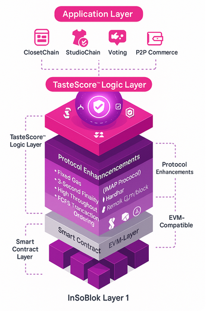
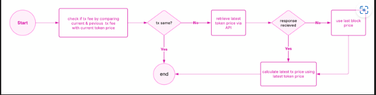
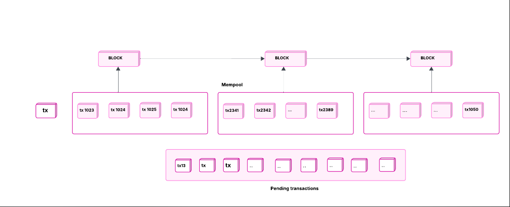
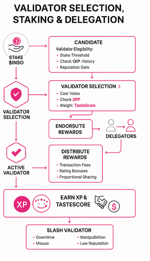
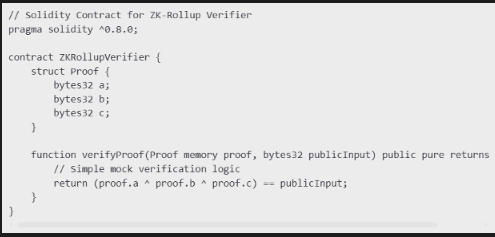
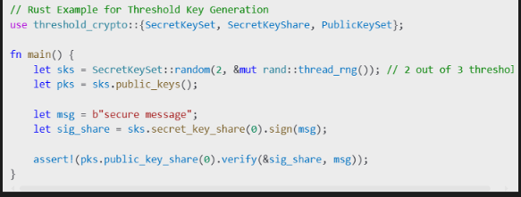
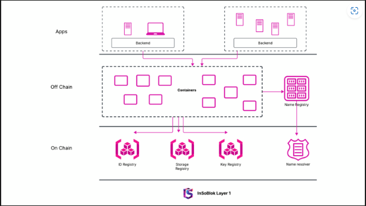
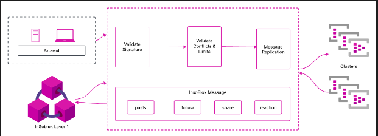
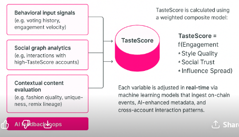
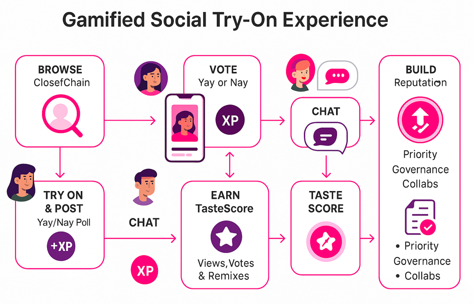

# White Paper with TasteScore V.01

### **InSoBlok AI White Paper - TasteScore**

### _**June 2025**_

#### _**Foundational Overview**_

1. **Abstract**

InSoBlok AI is a next-generation Layer 1 blockchain protocol designed to bridge the gap between Web3 infrastructure and the cultural, social, and economic behaviors of billions of digitally native users. While blockchain technology has seen over a decade of innovation, widespread adoption continues to be hindered by persistent frictions-high transaction costs, limited throughput, and poor onboarding experiences. These challenges have prevented blockchain from realizing its full potential across industries like retail, social media, creator monetization, gaming, and real-world asset tokenization.

InSoBlok AI directly addresses these barriers through an ultra-fast, fixed-cost architecture capable of supporting micro-transactions at just $0.0005 per transaction, paired with a radically simplified user onboarding flow. However, its most defining innovation lies in its fusion of blockchain infrastructure with intelligent, socially-aware systems-introducing **TasteScor -**&#x61;n AI-powered, composable reputation layer that tokenizes cultural influence, aesthetic discernment, and social engagement. TasteScore enables users to build portable on-chain identities, influence governance, and earn real value through their content, style, and community contributions.

By embedding AI agents, real-time virtual try-on systems, and gamified social mechanics into the protocol itself, InSoBlok AI reimagines what it means to participate in a digital economy. It is not just a new blockchain-it is a decentralized operating system for creator-led commerce, identity-driven interaction, and intelligent social coordination. With a scalable technical foundation and a culturally fluent user layer, InSoBlok AI is positioned to power the next era of digital ownership and unlock mass adoption across the global creator economy.

1. **InSoBlok AI Vision**

The digital economy is at an inflection point. For years, creators, consumers, and brands have operated within walled gardens governed by centralized platforms-monetizing engagement without enabling ownership, distributing content without transparent value attribution, and shaping culture while limiting individual economic power. These legacy systems extract value at scale but return minimal control to the very users who generate it.

InSoBlok AI envisions a new reality: a blockchain-powered ecosystem where **influence becomes capital, ownership is absolute, and intelligent systems power creative expression at scale**.

Insert New Video Here

At its core, InSoBlok AI is not simply a platform, but a decentralized infrastructure stack purpose-built to enable the **next era of creator-led economies**. Designed as a high-performance Layer 1 blockchain, it fuses **AI-powered personalization**, **SocialFi primitives**, and **tokenized Real World Assets (RWAs)** into a unified protocol that empowers creators, communities, and enterprises to transact, collaborate, and grow on their own terms.

Where Web2 monetizes users through opaque algorithms and attention extraction, InSoBlok AI aligns incentives by building an ecosystem where **every vote, try-on, post, and purchase contributes to measurable value**-owned and controlled by the user. By enabling seamless, low-cost transactions and composable identity layers, the protocol removes onboarding friction and makes blockchain-native interaction intuitive for the next billion users.

A central component of this vision is **TasteScore™**, a protocol-native, AI-enhanced reputation engine that quantifies aesthetic leadership, social resonance, and cultural intuition. TasteScore transforms subjective elements like taste, style, and influence into a **portable, tokenized metric** that drives governance power, monetization access, and discovery relevance across the ecosystem.

This unlocks a new social-economic paradigm where:

* Influence is earned and measured transparently
* Content curation is governed by community taste-not platform bias
* Creators are rewarded for their impact, not just their reach
* Users co-create value and governance through participation

InSoBlok AI’s initial focus is fashion-a culturally rich, trend-driven industry where creators shape market demand in real time. But the protocol’s architecture is designed for extensibility into beauty, wellness, health, entertainment, and other verticals where **personal expression, identity, and taste** drive consumer decisions.

This vision is not speculative-it is underway. The creator economy is expanding. The demand for transparency, ownership, and self-sovereignty is rising. And Web3 users are looking for platforms that move beyond hype to deliver real infrastructure for expression, monetization, and community-driven governance.

1. **Introduction**

The emergence of Web3 has opened a new frontier for digital ownership, decentralized value creation, and user-driven governance. Yet despite the exponential rise of the creator economy and increasing demand for transparency, the infrastructure to fully empower influencers, brands, and communities remains fragmented and incomplete. Legacy social platforms continue to extract value disproportionately-offering creators minimal monetization pathways, limited control over their content, and zero ownership over the social capital they generate.

**InSoBlok AI** is a Layer 1 blockchain ecosystem purpose-built to address this gap. At the intersection of **social media, AI, and blockchain**, it introduces a radically new infrastructure for influencer-led commerce, intelligent content monetization, and decentralized identity. Designed with **Dynamic Sovereignty™** at its core, InSoBlok AI empowers users to take full control of their digital presence, data, and economic participation-unlocking a new model of creator capitalism that is equitable, programmable, and infinitely scalable.

The protocol targets structural inefficiencies within the **$2.8 trillion global markets** of fashion, personal care, and health & fitness-industries where influence, aesthetics, and community engagement are core drivers of demand. InSoBlok AI offers a verticalized stack of tools that enable creators to **collaborate directly with brands**, tokenize digital assets, and monetize engagement through transparent, trustless, and intelligent systems.

At the center of this ecosystem is **ClosetChain™**, the world’s first AI-integrated, blockchain-native platform for influencer commerce. ClosetChain provides users with real-time virtual try-ons, smart product linking, NFT minting, tokenized wardrobes, and gamified e-commerce workflows-all secured by the **$INSO utility token** and governed by an open, reputation-weighted model.

A defining innovation within this framework is **TasteScore -**&#x61; dynamic, AI-driven reputation protocol that quantifies social influence, style intuition, and aesthetic leadership into a **composable on-chain score**. This reputation layer functions as a new kind of currency-enabling users to:

* Unlock visibility, incentives, and rewards based on collective validation
* Participate in governance and platform evolution with taste-weighted voting power
* Build transferable, sovereign identities that reflect real social capital

Unlike passive metrics like likes or followers in Web2, TasteScore is **actionable, composable, and economically significant**. It ensures that users who drive cultural relevance are also those who benefit most from the platform’s growth.

By fusing the **predictive intelligence of AI**, the **security and transparency of blockchain**, and the **engagement logic of social media**, InSoBlok AI offers an integrated solution to one of the internet’s biggest structural failures: the misalignment of cultural creation and economic participation.

InSoBlok AI does not simply propose a new application-it delivers an entire **economic protocol for digital expression**, unlocking frictionless collaboration between creators, brands, and audiences in an open, trustless environment. This is the infrastructure layer for the next generation of commerce-one where **taste is quantifiable, ownership is sovereign, and creativity is rewarded by design.**

1. **The InSoBlok Approach: SocialFi + AI + Tokenization**

The vision behind InSoBlok AI is not simply to launch another blockchain-it is to engineer a vertically optimized protocol for the next era of digital engagement: one rooted in **cultural capital, personalized experience, and decentralized ownership**. To realize this, the InSoBlok approach combines the technical rigor of proven blockchain foundations with deep innovations in **AI coordination**, **social interaction mechanics**, and **tokenized reputation**.

Rather than reinventing from scratch, InSoBlok AI strategically begins with the **Go Ethereum (Geth)** codebase-a battle-tested, production-grade architecture trusted by millions. This ensures immediate compatibility with developer tooling, smart contract libraries, and node infrastructure, while dramatically reducing risk, cost, and time-to-market. On top of this foundation, InSoBlok applies protocol-level enhancements to optimize for the **social and experiential dimensions** of Web3.

These enhancements are designed to fulfill five non-negotiable principles:

#### **1. Ultra-Low, Predictable Costs for End Users**

A core mandate of InSoBlok is to ensure blockchain interaction is not cost-prohibitive. The protocol implements **fee capping and subsidy mechanisms** to maintain an ultra-low fixed cost of **$0.0005 per transaction**, regardless of network congestion. This enables:

* Micro-transactions
* NFT minting at scale
* Real-time commerce flows
* Frictionless UX for mobile and casual users

By eliminating price volatility at the transaction layer, InSoBlok AI becomes viable for creators and consumers in regions where gas costs would otherwise be a barrier.

#### **2. Real-Time UX for Personalized, AI-Driven Experiences**

Modern social platforms thrive on **instant feedback** and **fluid interaction**. InSoBlok AI builds for this paradigm by introducing **AI-powered execution environments** with sub-second response times and real-time virtual asset rendering-essential for features like:

* Avatar-based Virtual Try-Ons (ClosetChain)
* Gamified Yay/Nay Voting
* Socially-driven e-commerce triggers

These experiences are not only real-time, but **adaptive**-with personalization engines powered by user preferences, on-chain history, and **TasteScore-weighted AI agents**.

#### **3. Protocol-Level Security and Trust**

Security is foundational for ecosystem adoption-particularly among influencers, brands, and enterprise partners. InSoBlok AI inherits Ethereum’s robust security posture while integrating additional safeguards, including:

* Upgraded validator slashing rules
* AI-based anomaly detection in voting and content fraud
* Encrypted metadata layers for P2P and commerce privacy

These features ensure that user assets, identity, and data remain secure, verifiable, and tamper-proof-making the platform credible for large-scale, brand-integrated commerce.

#### **4. Horizontally Scalable Infrastructure**

To onboard billions of users, InSoBlok AI must operate at global scale without compromising experience. The architecture introduces:

* **Layer 1 optimizations** for parallelized execution
* **Modular Layer 2 rollups** for specialized workloads (e.g., LookBook, VTO, or TasteScore consensus)
* **State channels and edge caching** for latency minimization in high-frequency interactions

This layered approach provides both scalability and functional isolation-allowing personalized AI agents and tokenized content to scale independently while maintaining a consistent state view.

#### **5. Carbon-Neutral Commitment**

In alignment with sustainable development principles, InSoBlok AI is committed to achieving **net-zero emissions**. All validator infrastructure is required to run on **renewable energy or verified carbon offsets**, and the protocol itself includes mechanisms for **carbon footprint tracking and tokenized offset integration.**

By making environmental sustainability a protocol-level principle, InSoBlok AI demonstrates leadership not only in technology, but in ethical digital stewardship.

### **TasteScore: A Protocol-Native Logic Layer for Social Coordination**

Where traditional blockchains focus on consensus and throughput, InSoBlok introduces **TasteScore™ as a native social consensus mechanism**-a system that captures cultural relevance, peer validation, and aesthetic intuition into an on-chain score that governs:

* **Access to perks, early drops, and premium commerce tools**
* **Curation power across the platform (e.g. voting outcomes, leaderboard rankings)**
* **Monetization multipliers based on social value creation**
* **Influencer-brand matchmaking based on TasteScore signals and past performance**

TasteScore is fully embedded into the protocol’s identity layer, reputation logic, and smart contract execution paths-ensuring that every post, vote, or interaction has **economic and governance significance**. It enables a **proof-of-taste economy** where influence isn’t just earned-it’s **measured, tradable, and rewarded**.

By anchoring itself in proven code while layering in deep innovations in AI, tokenization, and social UX, **InSoBlok AI becomes more than a chain**-it becomes an adaptive, composable, and culture-aware **platform layer for the intelligent, decentralized internet**.

#### _**Core Protocol & Infrastructure**_

1. **Protocol Enhancements & Architectural Overview**

InSoBlok AI is architected from the ground up to serve the evolving needs of a decentralized, creator-centric economy-where reputation, influence, and ownership are key primitives of both interaction and value. To achieve this, the protocol introduces a series of enhancements to the base-layer blockchain architecture. These enhancements are specifically designed to optimize for four foundational pillars: **cost-efficiency**, **speed**, **equity**, and **scalability**-while incorporating **TasteScore™** as a system-native logic engine that governs everything from transaction prioritization to token economics.

Rather than building entirely from scratch, InSoBlok AI strategically extends the **Go Ethereum (Geth)** codebase-an open-source, production-proven, and extensively audited foundation that powers much of the existing Web3 ecosystem. This decision allows InSoBlok to retain compatibility with a vast library of EVM-based tools while introducing key protocol-level innovations that unlock new dimensions of social and economic interaction.

The following enhancements constitute the backbone of the InSoBlok AI blockchain:

#### 5.1 **Fixed Transaction Fees: Predictable Costs for Scalable Commerce**

One of the core limitations of traditional Layer 1 protocols is **variable and often prohibitive transaction costs**. Fluctuating gas fees create uncertainty for developers and hinder scalability for transaction-intensive applications such as social voting, creator monetization, and micro-commerce.

InSoBlok AI addresses this challenge by implementing a **predictable, fiat-pegged fixed fee model**:

* Every transaction on the network costs a **capped $0.0005 USD equivalent**, regardless of the market volatility of the native $INSO token.
* This fixed fee is made possible through an **on-chain/off-chain oracle mechanism** managed by the InSoBlok Foundation, which continuously updates token price data and dynamically adjusts gas conversion rates to preserve fiat equivalence.

By decoupling gas fees from token market fluctuations, InSoBlok enables:

* Sustainable business model planning
* High-frequency creator engagement
* Frictionless onboarding for billions of mainstream users

#### 5.2 **High-Speed Finality: A 3-Second Global Social Chain**

User experience is paramount in SocialFi, where real-time interaction defines utility. InSoBlok AI is optimized for **maximum responsiveness**, with:

* **Block times capped at 3 seconds**
* **Instant finality mechanisms** to reduce UI latency
* **Concurrent transaction execution** to support complex social actions like Virtual Try-Ons (VTO), Yay/Nay voting, and tokenized swaps

This architecture ensures that decentralized applications (dApps) built on InSoBlok deliver **the same or better responsiveness than Web2 platforms**, but with the benefits of transparency and on-chain verifiability.

#### 5.3 **High Throughput: Scalable Infrastructure for Creator Commerce**

To support global-scale SocialFi and e-commerce transactions, InSoBlok AI employs a **30 million gas-per-block configuration**, balancing block complexity and computational throughput. In combination with the rapid block time, this configuration enables:

* Real-time virtual try-on rendering
* Large-scale Yay/Nay voting events
* Creator monetization via dynamic NFT minting

The architecture is intentionally extensible, designed to support millions of daily users executing varied transaction types-from image uploads and social votes to full-fledged P2P payments and smart contract settlements.

#### 5.4 **Fair Transaction Ordering: First-Come, First-Served Logic**

To eliminate front-running and ensure equitable access for all users, InSoBlok AI adopts a **first-come, first-served (FCFS)** transaction ordering model. With no fee-based prioritization or bidding system:

* Validators **process transactions strictly in the order received** from the mempool.
* This ensures **equal opportunity for all creators and users**, regardless of the size or funding level of their project.

This approach is especially critical in use cases involving public voting, influencer drop events, and gamified content, where timing must be fair and manipulation-proof.

#### 5.5 **TasteScore™ as a Protocol Logic Layer**

Beyond traditional consensus mechanisms, InSoBlok introduces **TasteScore™-**&#x61;n AI-enhanced, on-chain reputation system that acts as a programmable social layer woven directly into the protocol. TasteScore affects:

* **Discovery Algorithms**: Higher TasteScores result in greater content visibility.
* **Governance Influence**: Voting weight and DAO proposal authority are linked to user TasteScores.
* **Token Rewards**: XP and $INSO earnings are influenced by a user’s validated social impact.
* **Transaction Flexibility**: In future iterations, users with high TasteScores may be prioritized for certain zero-gas interactions.

By embedding **reputation-weighted consensus** into the system, InSoBlok AI evolves from a transactional network into a **culturally-aware economic layer**, where users with aesthetic and social influence are recognized not just by metrics-but by protocol logic itself.

#### 5.6 **Native Token Utility: $INSO**

The **$INSO** token serves as the native gas and utility token across the ecosystem, with use cases including:

* Gas for all protocol-level transactions
* Minting and trading of digital wardrobe NFTs
* Payments for AI-enhanced features like personalized VTOs
* Staking for validator selection and security
* Reward incentives based on TasteScore, voting activity, and content performance

A hard cap ensures long-term scarcity and sustainable monetary policy, while the **TasteScore-linked reward curve** ensures that high-impact participants earn proportionally more from the protocol’s growth.

#### 5.7 **EVM Compatibility: Frictionless Integration and Developer Onboarding**

To ensure rapid adoption and maximize ecosystem interoperability, InSoBlok AI maintains full **Ethereum Virtual Machine (EVM) compatibility**, including:

* Solidity-based smart contract execution
* Integration with popular dev tools (e.g., Hardhat, Remix, Truffle)
* Compatibility with wallets like MetaMask and WalletConnect

This enables any developer familiar with EVM chains to **instantly deploy and scale** on InSoBlok AI, and for existing projects to expand or migrate with minimal friction.

1. **Validator Selection, Staking, and Delegation**

To ensure a secure, scalable, and culturally aligned consensus model, InSoBlok AI implements a **hybrid consensus mechanism** that combines **Delegated Proof-of-Stake (DPoS)** with an innovative **Proof of AI Contribution (PoAC)** layer. This hybrid design not only delivers high throughput and energy efficiency but also incorporates **behavioral intelligence and social reputation** as core inputs into validator incentives, selection, and accountability.

This framework enables InSoBlok AI to support its mission as a **socially dynamic, AI-native Layer 1-**&#x77;here trust is not just computational, but also **reputation-aware and influence-weighted** through integrated metrics like **TasteScore™** and XP (experience points).

#### 6.1 **Validator Eligibility and Selection Process**

Validator participation is governed by an **on-chain, decentralized election protocol** where validator candidates must pass both objective and reputation-based thresholds.

**Selection Criteria:**

* **Stake Threshold**: Validators must stake a minimum amount of $INSO tokens to be eligible.
* **Community Voting**: Existing validators cast weighted votes. A new candidate must receive **>50% approval** to be admitted.
* **Reputation Gatekeeping**: AI systems evaluate each candidate’s **XP history**, **uptime**, **past governance behavior**, and **TasteScore™-linked community alignment** before entry into the active set.

This **multi-layered eligibility model** ensures that new validators are not only technically capable but also socially validated and behaviorally incentivized.

#### 6.2 **Delegation Model and Stake Dynamics**

InSoBlok AI enables token holders to participate in consensus via **delegated staking**, aligning passive users with active validators in a mutually beneficial economic loop.

**Delegation Mechanics:**

* **Delegators** can stake $INSO tokens to any active validator of their choice.
* **Delegated stake** boosts the validator’s selection power and share of network throughput.
* **Rewards** are split proportionally between validator and delegators based on:
  * Validator uptime & performance
  * Community governance participation
  * TasteScore and XP levels

AI-driven delegation dashboards help users choose **high-performing, high-integrity validators**, using real-time metrics and predictive indicators derived from on-chain data and community feedback.

#### 6.3 **XP-Based Reputation and Validator Ranking**

InSoBlok AI introduces **XP (Experience Points)** as a native, non-transferable metric that tracks behavior and contribution across the protocol. XP affects:

* **Validator visibility and discoverability**
* **Reward multipliers in staking payouts**
* **Eligibility to participate in advanced governance roles**

XP is earned through:

* High block production uptime
* Active participation in TasteScore™-weighted voting
* Honest behavior during protocol upgrades
* Support of ecosystem tools, educational content, or dispute resolution

Validators with higher XP are rewarded not just economically but with **increased trust and influence** across the InSoBlok ecosystem.

#### 6.4 **TasteScore™-Weighted Governance & Rewards**

In addition to XP, **TasteScore™** serves as a **social-reputation layer** that enhances validator influence in areas where aesthetic alignment, community sentiment, and cultural impact matter.

Validators and delegators with high TasteScores benefit from:

* **Enhanced reward multipliers**
* **Governance weight in creator economy tooling (e.g., ClosetChain drops, fashion token approvals)**
* **Priority access to influencer collaborations and ecosystem campaigns**

This system ensures that **technical security** is balanced with **cultural sensitivity**, aligning validator behavior with the social layer of InSoBlok AI.

#### 6.5 **Validator Rewards & Economic Model**

Unlike inflationary PoS chains, InSoBlok AI operates on a **transaction fee–based incentive model**, where value is earned directly from network activity, not via unsustainable token emissions.

**Validator Incentive Features:**

| **Feature**               | **Functionality**                                                                     | **Unique Innovation**                                                              |
| ------------------------- | ------------------------------------------------------------------------------------- | ---------------------------------------------------------------------------------- |
| Transaction-Based Rewards | Real-time distribution of fees to validators and delegators.                          | Eliminates inflationary block rewards; supports long-term economic sustainability. |
| AI-Optimized Yield Model  | AI adjusts yield based on transaction volume, validator XP, and TasteScore data.      | Dynamic, performance-based incentives.                                             |
| Proportional Distribution | Delegators receive rewards based on stake, validator output, and social contribution. | Incorporates XP and TasteScore to reflect deeper value creation.                   |
| Reputation-Based Bonuses  | High XP + TasteScore validators receive tiered multipliers.                           | Rewards honesty, uptime, and alignment with the creator economy’s values.          |

#### 6.6 **Slashing & Behavioral Enforcement**

To protect the protocol against malicious or negligent behavior, InSoBlok AI implements **intelligent slashing conditions** triggered by both **technical violations** and **social dishonesty**.

**Slashing Triggers:**

* Double signing or downtime
* Misuse of delegated funds
* Algorithmically flagged manipulation (e.g., reward gaming)
* Negative TasteScore drop below protocol thresholds

In addition, validators can be **downgraded or excluded** from special programs (e.g., influencer collabs, governance committees) based on sustained poor XP or TasteScore performance.

### **AI-Powered Execution & Tokenization Infrastructure**

InSoBlok AI redefines what is possible at the smart contract layer by embedding **AI intelligence natively into the execution environment**. Beyond simply facilitating transactions, InSoBlok’s execution layer operates as an **autonomous, adaptive orchestration engine**, capable of optimizing transaction flow, predicting usage spikes, and adapting governance logic in real time.

Built on an **Ethereum Virtual Machine (EVM)-compatible framework**, InSoBlok AI provides developers with a familiar interface while introducing a powerful set of AI-driven primitives designed to meet the complex demands of **SocialFi, creator economies, and tokenized commerce** at scale.

#### 7.1 **EVM Compatibility + AI Intelligence: A New Execution Paradigm**

InSoBlok AI’s smart contract environment maintains full EVM compatibility-ensuring seamless migration and interoperability for existing dApps, tooling, and developer ecosystems. However, this layer goes far beyond standard Solidity execution.

By integrating **reinforcement learning**, **graph-based reasoning**, and **predictive analytics models**, InSoBlok enables the next evolution of smart contracts-ones that can:

* Optimize their own gas expenditure
* Adapt to real-time demand and latency
* Prevent contract-level exploits using anomaly detection and simulation
* Dynamically adjust reward logic based on user behavior and system metrics

These capabilities allow for **self-tuning smart contracts** that evolve with the network and provide **autonomous decision-making** at scale, removing the need for frequent manual upgrades and reducing governance friction.

#### 7.2 **AI-Enhanced Smart Contract Orchestration**

InSoBlok’s AI infrastructure includes a multi-agent system that supports intelligent execution routing, contract pre-processing, and behavioral forecasting.

**Key Capabilities:**

* **Adaptive Transaction Routing**:\
  Contracts automatically select the most cost-efficient and performant routes across InSoBlok’s modular Layer 1 and Layer 2 environments. Reinforcement learning models continuously assess network conditions to minimize latency and optimize user experience.
* **Decentralized Load Balancing**:\
  Validator nodes are dynamically assigned workloads based on current capacity, historical reliability, and projected demand. AI agents optimize this distribution to prevent bottlenecks and ensure high throughput even under congestion.
* **Energy-Aware Execution Logic**:\
  Smart contracts adjust their consensus participation based on overall network activity and validator availability. AI models detect ideal times to defer or batch computation, significantly reducing InSoBlok AI’s environmental footprint while maintaining system security.

#### 7.3 **TasteScore™ Integration: AI Personalization + Social Reputation in Execution**

InSoBlok AI embeds **TasteScore™ directly into the execution infrastructure**, allowing smart contracts to dynamically adapt logic based on **user reputation, influence, and behavioral patterns**.

Examples include:

* **Differential Transaction Handling**: High TasteScore users receive prioritized settlement on certain dApps, or reduced wait times in queue-based voting systems.
* **Smart Contract Personalization**: NFT drops, commerce offers, and rewards dynamically shift based on the TasteScore, engagement rate, or fashion category alignment of the user.
* **Reputation-Weighted Tokenization**: When minting digital assets, the protocol adjusts rarity tiers or scarcity multipliers based on a creator’s cumulative TasteScore and XP.

TasteScore integration allows **on-chain logic to reflect off-chain influence**, bridging social and computational trust in a programmable and permissionless way.

#### 7.4 **AI-Driven Tokenization of Real World and Digital Assets**

The InSoBlok infrastructure supports **frictionless tokenization** of both physical and digital assets through intelligent abstraction layers. Smart contracts can mint, manage, and price assets using dynamic data feeds, including:

* Market demand forecasts
* Social voting outcomes (e.g., Yay/Nay ratios)
* AI-generated style trend projections
* On-chain usage data (e.g., frequency of Virtual Try-Ons)

This unlocks novel capabilities:

* **Self-pricing NFTs**: Items update their price floor based on virality or rarity metrics.
* **Dynamic Fashion Collections**: Digital wardrobes evolve with seasons, trends, and TasteScore-weighted feedback loops.
* **AI-backed fractional ownership**: Luxury fashion or beauty routines can be co-owned and resold using programmable token splits, governed by community demand signals.

#### 7.5 **Validator Incentives in an AI-Orchestrated System**

InSoBlok AI moves beyond the limitations of inflationary block rewards by introducing a **fee-based validator economy**-augmented by AI-tuned yield models and behavioral scoring.

| **Feature**                      | **Functionality**                                                                                | **AI-Driven Innovation**                                    |
| -------------------------------- | ------------------------------------------------------------------------------------------------ | ----------------------------------------------------------- |
| **Transaction Fee Rewards**      | Validators and delegators earn real-time fees from protocol activity                             | Tied to real utility, not inflation                         |
| **Proportional Distribution**    | Rewards scaled based on stake, uptime, and TasteScore-weighted governance participation          | Aligns incentives with performance and community reputation |
| **Dynamic Yield Adjustments**    | AI analyzes usage patterns and adjusts validator rewards in real-time                            | Incentivizes load balancing and high-value node behavior    |
| **Reputation-Based Multipliers** | High TasteScore or XP unlocks tiered rewards, reducing the power of capital-only validator sets. | Makes staking more inclusive and culture-aligned            |

This economic framework ensures that **network security is balanced with social legitimacy**-rewarding not just performance, but also the validator’s relationship to the ecosystem’s values and creative participants.

### **Dynamic Sovereignty™: Self-Sovereign Ownership**

The evolution of decentralized systems demands more than just disintermediation-it requires a **paradigm shift in how identity, value, and trust are structured and enforced**. InSoBlok AI introduces **Dynamic Sovereignty™**, a protocol-native framework for self-sovereign identity, secure asset ownership, programmable data privacy, and adaptive governance.

Unlike traditional decentralized identity systems, Dynamic Sovereignty integrates **AI-driven governance**, **zero-knowledge cryptography**, and **TasteScore™-linked social logic** into a unified model of intelligent, ethical, and composable user control. This framework enables **users, influencers, and enterprises** to securely own and monetize their data, govern their identity contextually, and participate in a fair and reputation-aware digital economy.

#### 8.1 **Core Components of Dynamic Sovereignty**

**Self-Sovereign Identity (SSI)**

InSoBlok AI incorporates advanced Self-Sovereign Identity frameworks using **Decentralized Identifiers (DIDs)** and **Verifiable Credentials (VCs)** in line with W3C standards. Identity information-including encrypted biometric markers and behavioral patterns-is safeguarded with:

* **Elliptic Curve Cryptography (ECC)**
* **Zero-Knowledge Proofs (ZKPs)**
* **Threshold-based private key protection**

This enables **decentralized yet verifiable identities**, where users retain **exclusive control** over their data without reliance on centralized authorities, login providers, or data brokers.

**AI-Assisted Adaptive Governance**

Governance in InSoBlok AI is **not static**, but powered by **AI-enhanced consensus logic**:

* Reinforcement learning models optimize voter incentives and policy weighting
* Federated machine learning algorithms analyze behavior across ecosystems
* On-chain engagement data feeds into governance scoring engines

This AI layer dynamically recalibrates voting thresholds, validator reputation, and participation rewards-aligning system-wide incentives with **honest, meaningful behavior** rather than raw capital or bot activity.

**Secure, Tokenized Ownership Models**

Built on standards like **ERC-1400** and **ERC-1155**, InSoBlok supports seamless, cross-asset ownership with:

* **Fractionalization** of real-world and digital assets
* **Automated compliance** via embedded policy checks
* **Multi-sig and ZK-audited smart contracts** for transaction security
* **Provenance tracking and royalty enforcement** using on-chain metadata

This ensures that **NFTs, RWAs, and creator content** are **not only owned-but protected, monetizable, and composable** across the ecosystem.

#### 8.2 **TasteScore™ as a Sovereign Reputation Layer**

Dynamic Sovereignty is deeply integrated with **TasteScore™**, InSoBlok’s AI-driven reputation protocol that transforms **influence into programmable trust**. In this system:

* **Identity is verified not just by documentation but by taste, behavior, and social impact**.
* **Reputation is earned** by voting, creating, and participating--and **expressed through a score that unlocks access, rewards, and governance rights**.
* High-TasteScore users benefit from **enhanced privacy tiers, zero-gas transaction windows, and early access to premium drops**.

Unlike Web2 where influence is siloed and monetized by platforms, TasteScore in InSoBlok AI is **user-owned, composable across dApps**, and enforces reputation-aware logic in every transaction-from NFT minting to DAO votes.

#### 8.3 **Data Monetization & Consent Layer**

In a world where user data drives trillion-dollar markets, Dynamic Sovereignty restores **agency and monetization rights** to the individual. InSoBlok AI embeds a **consent-driven data monetization framework** into the protocol core:

* Users define **granular permissions** over how their on-chain behavior, taste signals, and profile metadata can be accessed or sold
* AI agents **negotiate on behalf of the user** to license anonymized behavioral data for fashion analytics, campaign optimization, and product feedback loops
* **All monetized data streams are transparent**, on-chain, and tied back to the original contributor via their DID + TasteScore index

This unlocks a **new data economy** where the user-not the platform-captures the value of their insights and attention.

#### 8.4 **Private Identity Models**

To ensure maximum privacy without sacrificing utility, InSoBlok AI supports a multi-mode identity stack:

* **Anonymous Mode**: Allows interaction with apps and voting systems without revealing wallet or profile linkage
* **Pseudonymous Mode**: Enables influencer-like branding with optional DID connection and protected IP
* **Verified Mode**: Connects real-world credentials for RWA ownership, brand licensing, or event access

Each mode includes **TasteScore segmentation**, so social influence is preserved while **contextual privacy boundaries** remain intact.

#### 8.5 **Key On-Chain Data Infrastructure**

| **Domain**               | **Functionality**                                                                                        |
| ------------------------ | -------------------------------------------------------------------------------------------------------- |
| **Identity & Profiles**  | DID-based structure using ZKPs, biometric hashing, and encrypted credentials                             |
| **Content & Engagement** | Immutable post/comment/vote logs with IPFS/Arweave-based decentralized storage                           |
| **Tokens & Finance**     | $INSO wallet history, staking logs, liquidity participation, DAO votes, and tipping activity             |
| **NFTs & RWAs**          | Full metadata, provenance, and compliance logs for asset transfer, fractionalization, and royalty splits |
| **Smart Contracts**      | On-chain execution records of affiliate deals, brand drops, voting events, and influencer analytics      |
| **Cross-Platform Media** | Media assets with timestamped, cryptographically verified hashes linked to profile and engagement layers |

#### 8.6 **Technical Innovations**

* **Zero-Knowledge Rollups (ZK-Rollups)**: Aggregate identity and transaction logic for privacy-preserving scalability

* **Homomorphic Encryption**: Enables secure data analytics without exposing sensitive data
* **Decentralized Key Management (DKM)**: Redundant multi-party systems protect against centralized key compromise

* **Interoperable Governance Layer**: Cross-chain reputation sync using Cosmos IBC, Polkadot Substrate, and DID bridges

#### 8.7 **Summary of Key Features**

| **Feature**                       | **Functionality**                                                              | **Unique Innovation**                                                        |
| --------------------------------- | ------------------------------------------------------------------------------ | ---------------------------------------------------------------------------- |
| **Self-Sovereign Identity**       | User-controlled DID & credentials, ZKP verified                                | Real-time identity control with multi-mode privacy architecture              |
| **AI-Driven Governance**          | Adaptive rules and voter incentives via ML models                              | Dynamic reconfiguration based on system-wide behavioral insights             |
| **Tokenized Ownership**           | NFTs & RWAs with fractional transfer, royalty protection, and dynamic metadata | Multi-standard enforcement with embedded compliance logic                    |
| **TasteScore™-Weighted Identity** | Cultural influence quantifies into programmable trust, access, and perks       | Identity-as-reputation fused with economic incentives                        |
| **Data Monetization & Consent**   | Transparent licensing of behavior, attention, and aesthetic data               | AI negotiates usage and auto-rewards users for insight generation            |
| **Private Identity Modes**        | Switchable privacy contexts across use cases and dApps                         | Maintains flexibility between anonymity, pseudonymity, and verified presence |

1. **Dynamic Sovereignty Architecture**

At the heart of InSoBlok AI lies a pioneering approach to data autonomy and identity control known as the **Dynamic Sovereignty Architecture**-a modular framework designed to maximize **privacy, composability, and sovereignty** for all ecosystem participants. This hybrid architecture is engineered for **Web3-native identity systems, AI-enhanced social validation, and programmable data monetization**, all while preserving the performance and usability required for mass adoption.

By distributing the trust surface between **on-chain contracts**, **off-chain storage layers**, and a **ZKAI-powered metadata computation layer**, InSoBlok AI allows users to **retain total ownership over their identity, data, and social capital**-a foundational necessity for any protocol serving the influencer economy, tokenized commerce, and decentralized governance.

#### 9.1 **Hybrid On-Chain / Off-Chain Framework**

InSoBlok AI separates **critical state logic** from **high-volume, performance-sensitive operations** using a dual-layer system:

**On-Chain Layer (Security-Critical State Management)**

The **on-chain contract layer**, deployed on **InSoBlok Layer 1**, ensures the cryptographic integrity and trustworthiness of identity mappings, validator interactions, and tokenized asset ownership. Only operations that require **immutability, consensus, or fraud protection** are processed on-chain. These include:

* Account creation and DID registration
* Rent payments to reserve message slots
* Key management for connected applications
* Token staking and governance voting
* Smart contract execution logs with TasteScore-conditional logic

By maintaining minimal but essential state on-chain, the protocol balances **security and cost-efficiency** while anchoring trust for higher-order operations off-chain.

**Off-Chain Layer (Performance-Critical Data Operations)**

The **off-chain execution layer** is composed of a distributed, peer-to-peer network of specialized servers known as **Containers**. These nodes handle high-throughput, low-latency operations such as:

* Posting public messages, media, or polls
* Following, liking, and replying
* Updating profile images, VTO metadata, or creator badges
* Decentralized chat (including emoji, image, P2P payments)

All off-chain actions are cryptographically signed using a user’s on-chain keys and validated according to protocol rules. This design supports **massively scalable, socially dynamic interactions** with strong **eventual consistency guarantees**.

#### 9.2 **Containers: Distributed Sovereignty Nodes**

**Containers** are decentralized data nodes that store and validate all InSoBlok AI user activity off-chain. Any participant can run a Container on local hardware or in the cloud, contributing to storage replication, gossip syncing, and diff-based message reconciliation.

Each Container:

* Syncs with Layer 1 to stay aware of all account keys and state
* Validates message signatures and constraints (e.g., byte limits, message lifespan)
* Stores user content, structured metadata, and TasteScore computation inputs
* Replicates messages across peers using **libp2p's gossipsub protocol**
* Enforces **CRDT (Conflict-Free Replicated Data Types)** to resolve update conflicts deterministically

Containers operate with **strong eventual consistency**, ensuring that nodes may fall behind temporarily but always catch up without state corruption.

#### 9.3 **Metadata Computation & ZKAI Privacy Layer**

To preserve privacy while enabling personalization, InSoBlok AI employs a **ZKAI-powered metadata layer**-a fusion of **zero-knowledge cryptography** and **AI inference engines** to process user behavior, preferences, and influence signals.

**Key Capabilities:**

* **On-device taste modeling** using AI agents that generate local recommendations without exposing raw preferences
* **Zero-Knowledge Proofs** verifying engagement stats (e.g., “voted on 20 Yay/Nay polls”) without revealing identities
* **Privacy-preserving TasteScore computation** where inputs are obfuscated and outputs verifiable but unlinkable

This enables **secure computation over encrypted data**, allowing for:

* Reputation-based ranking of posts, content, and influencers
* Governance voting eligibility tied to social contribution
* Personalized AI assistants (styling, content curation) that respect user privacy

ZKAI turns **social behavior into structured insights**-all while preserving confidentiality, preventing surveillance, and decentralizing data control.

#### 9.4 **Dynamic Sovereignty in Action**

**Data Lifecycle Flow:**

1. **Alice creates a post** via her mobile wallet.
2. Her device signs it with her on-chain account key.
3. The post is uploaded to a nearby Container node.
4. The node verifies the signature, applies message rules (e.g., ≤ 320 bytes), and stores it.
5. The message is gossiped to other Containers.
6. Metadata about Alice’s content engagement is computed locally (e.g., how many high-TasteScore users upvoted it).
7. Her TasteScore is updated, and the output is sealed with a ZKP.
8. Her next VTO, governance vote, or affiliate drop is affected by this updated score-without exposing the full computation chain.

This system forms a **self-reinforcing cycle** of interaction, verification, and value-anchored by consent, AI logic, and cryptographic trust.

#### 9.5 **Interoperability & Governance Extension Layer**

To support future expansion, the Dynamic Sovereignty Architecture includes a **modular governance bridge layer** powered by:

* **Polkadot Substrate runtime integrations**
* **Cosmos IBC-based consensus syncing**
* **DID-based cross-chain identity mapping**

This allows TasteScore, DID credentials, and engagement records to **flow across blockchain ecosystems**, enabling:

* Global reputation that spans across platforms
* Inter-chain governance voting
* Federated creator economies with consistent identity

#### Summary Table

| **Component**                     | **Functionality**                                                         | **Innovation**                                                |
| --------------------------------- | ------------------------------------------------------------------------- | ------------------------------------------------------------- |
| **On-Chain State Layer**          | Manages DIDs, tokens, governance keys                                     | Minimal, high-integrity layer anchoring trust                 |
| **Containers**                    | Decentralized P2P nodes for data storage, validation, and syncing         | High-performance off-chain UX with provable consistency       |
| **ZKAI Metadata Engine**          | Secure computation of TasteScore, influence metrics, and user insights    | AI + ZK = Personalized + private-by-design reputation scoring |
| **TasteScore™ Integration**       | Determines rewards, governance power, discovery ranking                   | On-chain composable metric of cultural relevance              |
| **CRDT & Gossip + Diff Sync**     | Resilient, conflict-free message syncing across global nodes              | Optimized for mobile, offline, and edge-first ecosystems      |
| **Privacy Modes & Consent Layer** | Enables selective visibility, monetization, and participation preferences | Dynamic privacy context and user-controlled data monetization |

#### _**User Engagement & Social Mechanisms**_

1. **TasteScore™ Reputation Engine**

At the heart of InSoBlok AI lies **TasteScore™**-a dynamic, AI-powered reputation system that tokenizes cultural relevance, aesthetic discernment, and social engagement into measurable on-chain value. Unlike static identity scores or popularity-based systems, TasteScore represents a **living, composable metric** that evolves with every interaction, content creation, and community validation event.

TasteScore™ is not merely a vanity number. It governs **platform visibility, voting weight, monetization potential, content discovery**, and long-term governance influence. It forms the foundation for a **reputation-as-capital economy**, enabling users to earn, trade, and utilize their influence across multiple dimensions of the InSoBlok AI ecosystem-from creator drops to DAO participation.

#### 10.1 **Purpose & Vision**

TasteScore™ was conceived to solve three core challenges in today’s creator and influencer economy:

* **Lack of context-aware social reputation**: Followers and likes offer no verifiable signal of actual influence, taste, or contribution.
* **Platform-dependent authority**: Reputation today is siloed in Web2 platforms, non-transferable and unverified.
* **Low-fidelity feedback loops**: Existing systems fail to reward nuance, style innovation, or early trend identification.

In contrast, TasteScore enables a **self-sovereign reputation layer** that lives on-chain, evolves with user behavior, and directly drives **monetary opportunity, governance power, and social discovery**.

#### 10.2 **Algorithmic Model**

The TasteScore engine is powered by a **multi-factor algorithm** that synthesizes:

* **Behavioral input signals** (e.g., voting history, engagement velocity)
* **Social graph analytics** (e.g., interactions with high-TasteScore accounts)
* **Contextual content evaluation** (e.g., fashion quality, uniqueness, remix lineage)
* **AI feedback loops** (e.g., generative AI interpreting style coherence or sentiment)

TasteScore is calculated using a **weighted composite model**:

TasteScore = f(Engagement \* Style Quality \* Social Trust \* Influence Spread)

Each variable is adjusted in real-time via machine learning models that ingest **on-chain events**, **AI-enhanced metadata**, and **cross-account interaction patterns**.

#### 10.3 **Source Inputs: VTO, Yay/Nay, Posts, Remixes**

TasteScore evolves through interaction with the following system touchpoints:

| **Input Source**          | **Scoring Contribution**                                                |
| ------------------------- | ----------------------------------------------------------------------- |
| **Virtual Try-Ons (VTO)** | Quality, uniqueness, and popularity of AI-powered fashion try-ons       |
| **Yay/Nay Voting**        | Consensus alignment, taste discernment, and community agreement rate    |
| **Lookbook Posts**        | Creativity, engagement velocity, remix participation, and originality   |
| **Remix Activity**        | Collaborative participation and trend propagation influence             |
| **Social Graph Actions**  | Weight of followers/followings, interactions with high-TasteScore peers |

All data is timestamped, cryptographically signed, and periodically recalibrated to prevent manipulation or sybil attacks.

#### 10.4 **Voting Influence, XP & Governance Weight**

TasteScore is linked to **on-chain XP (Experience Points)**, which accumulates through meaningful contributions. XP is non-transferable and acts as a **soul-bound metric**. XP levels directly affect:

* **Governance vote weight** in protocol proposals and funding allocation
* **Eligibility for token airdrops, ambassador roles, or branded campaigns**
* **Access tiers** to exclusive creator tools or smart contract functions

High TasteScore + XP users serve as **cultural validators**-recognized not for how loud they are, but how aligned their aesthetic is with the evolving taste of the network.

#### 10.5 **Economic Utility & Monetization Rights**

In a system driven by creativity and taste, **reputation becomes collateral**. TasteScore is used to:

* **Gate access to creator monetization modules** (e.g., NFT launch, P2P token sale, affiliate engine)
* **Prioritize content in discovery feeds** across Lookbooks, VTO galleries, and remix feeds
* **Enable fashion designers or health influencers to launch branded drops** backed by trust
* **Power creator DAOs**, where TasteScore multiplies governance voice in style councils or campaign selections

Over time, TasteScore becomes the **dynamic price oracle for attention, influence, and co-creation rights**.

#### 10.6 **Privacy, Tamper Resistance & Zero-Knowledge Integrity**

To preserve fairness and security:

* Scores are **calculated off-chain** in ZK-compatible environments and anchored to chain via **hash commitments**
* Users may **prove their TasteScore bracket (e.g., Top 10%)** without revealing exact values
* All source interactions used for scoring are cryptographically signed to prevent forgery

This ensures the system is **non-gameable, fair, and privacy-respecting**, even under competitive monetization models.

#### 10.7 **Governance & Community-Driven Calibration**

TasteScore’s parameters are not fixed. They are upgradable through:

* **Community-approved DAO proposals**
* **AI-informed feedback loops**, analyzing manipulation trends and evolving aesthetic patterns
* **Quadratic governance input**, where more users with moderate TasteScores can offset whale influence

This keeps the engine honest, responsive, and **socially anchored-not plutocratically distorted**.

#### Summary Table

| **Component**            | **Functionality**                                                             | **Innovation**                                                  |
| ------------------------ | ----------------------------------------------------------------------------- | --------------------------------------------------------------- |
| TasteScore™ Core Engine  | Tracks user influence, taste, and contribution across social/commerce actions | AI + social + creative scoring fused into on-chain reputation   |
| Source Inputs            | VTOs, voting, posts, remixes, XP, social interactions                         | Multimodal input stream with zero-knowledge proof compatibility |
| XP & Voting Weight       | Maps TasteScore to governance rights, rewards, and campaign access            | Soulbound XP incentivizes depth and consistency                 |
| Monetization & Discovery | Drives access to creator monetization tools and ranking in discovery feeds    | Real-time score boosts or mutes visibility and opportunity      |
| Privacy & ZK Integrity   | Off-chain AI computation with on-chain verifiability via ZK proofs            | Fully private yet verifiable scoring model                      |
| DAO Calibration Layer    | Community-defined weighting of inputs and algorithms                          | Adaptive engine tuned by real culture, not static code          |

TasteScore™ isn’t just a feature. It is the **identity substrate** of InSoBlok AI-a programmable layer of taste, trust, and time invested. It empowers users not only to be seen but to be **recognized, rewarded, and elevated** for their aesthetic intelligence and social resonance. In a world ruled by content, **TasteScore is the new currency of culture**.

1. **Gamified UX: Social Try-On & Interaction**

The future of digital engagement lies not in passive consumption, but in immersive, gamified participation. InSoBlok AI redefines the user experience by blending the viral nature of social media with blockchain-powered rewards and AI-enhanced personalization. Through ClosetChain™, TasteScore™, and the Yay/Nay™ voting system, InSoBlok introduces a playful yet purposeful UX-where every post, swipe, and social interaction unlocks real value and reputation.

This gamified design transforms everyday activities-trying on fashion, voting on looks, chatting with peers-into high-impact actions that accumulate TasteScore, unlock XP, and generate $INSO token rewards.

#### 11.1 **ClosetChain™: Virtual Try-On as Gameplay**

ClosetChain™ is the world’s first blockchain-native, AI-powered try-on system, turning fashion and personal care discovery into a social game.

* **Multi-Source Input**: Users can select items to VTO from NFT-based Marketplace items, livestream screenshots, URL uploads, or their personal photo albums.
* **Try-On Engine**: AI renders the item onto the user’s avatar or uploaded image using advanced pose estimation and style transfer techniques.
* **Gamified Prompting**: After each VTO, users are prompted to post the look to their Lookbook, initiate a Yay/Nay poll, or remix the style for a new TasteScore-earning opportunity.

Every successful VTO adds to the user’s TasteScore, with bonus points for originality, trend-setting, and community engagement.

#### 11.2 **Yay/Nay Voting™: Instant Feedback, On-Chain Signal**

Fashion, personal care, and wellness are subjective-but TasteScore quantifies taste through **community-powered voting**.

* **Live Polls**: Users can initiate Yay/Nay polls on any VTO or post. Followers and friends vote anonymously, contributing to the item's score.
* **XP Boosting**: Consistently participating in voting earns XP. Being aligned with the majority consensus or predicting future trends increases one’s TasteScore faster.
* **Cultural Indexing**: Yay/Nay data is aggregated into trend graphs, enabling influencers, brands, and DAOs to discover emerging aesthetics and product hits early.

This mechanism makes style validation transparent, fun, and tokenizable-bridging subjective expression with on-chain trust.

#### 11.3 **Swipe-to-Earn™: Discover, React, Earn**

Inspired by Gen Z-friendly UX patterns like TikTok and BeReal, InSoBlok introduces a **Swipe-to-Earn** interface where users can explore content rapidly while earning rewards.

* **Swipe Interface**: Users swipe through community VTOs, Looks, and Style Remixes.
* **Quick Reactions**: Voting, saving, sharing, or remixing a post generates TasteScore points.
* **Micro-Actions, Macro Impact**: The more authentically users engage with posts (i.e., not bots or spam), the more weight their reactions have-backed by AI verification.

Swipe-to-Earn transforms social browsing into active value generation, with TasteScore acting as the meta-currency of recognition.

#### 11.4 **Peer Chats: Private, Encrypted, Expressive**

SocialFi should feel like a real conversation, not just a comment thread. InSoBlok integrates **end-to-end encrypted chats** that are:

* **Metadata Private**: Powered by ZK-based routing, chats retain no metadata trails-only sender/receiver validation.
* **Rich & Expressive**: Share emojis, stickers, GIFs, VTO previews, or even micropayments via $INSO.
* **P2P Commerce Embedded**: Users can send VTOs for approval, split digital purchases, or co-own NFTs directly through chat.

These peer connections foster intimacy and trust, turning followers into communities-and communities into DAO-led microeconomies.

#### 11.5 **TasteScore™ Integration: Reputation Through Interaction**

All gamified UX layers are unified under **TasteScore™**, which acts as the glue between activity and reputation. The more a user engages meaningfully-with style, substance, or support-the higher their TasteScore climbs.

| **Action**                     | **TasteScore Boost**                     |
| ------------------------------ | ---------------------------------------- |
| Posting a VTO                  | +5 to +20 (based on originality + votes) |
| Participating in Yay/Nay Polls | +2 to +10 (accuracy weighted)            |
| Starting a Style Remix Chain   | +10 (multiplies with each remix)         |
| Peer-to-Peer Chat Engagement   | +1 to +5 (verified and sustained convo)  |
| Swipe-to-Earn Reactions        | +0.5 per action (capped daily)           |

These micro-rewards fuel macro growth: high TasteScore users get **priority visibility, campaign eligibility, governance power**, and brand collaboration offers.

#### Summary Table: Gamified UX Mechanics

| **Feature**            | **Functionality**                                           | **Innovation**                                             |
| ---------------------- | ----------------------------------------------------------- | ---------------------------------------------------------- |
| ClosetChain™ VTO       | Try on tokenized fashion/personal care in AR or static form | AI-powered personalization + blockchain-verified inventory |
| Yay/Nay Voting™        | Community rates style choices in real-time polls            | XP-based consensus & trend signaling                       |
| Swipe-to-Earn™         | Rapid content discovery + low-friction rewards              | Micro-actions drive macro reputation gains                 |
| Peer Chats + Emoji/GIF | Private, encrypted social layer with commerce hooks         | Emotional expression meets commerce + security             |
| TasteScore™ Reputation | Aggregates actions into on-chain, soulbound reputation      | Decentralized influence system with XP and governance ties |

InSoBlok AI doesn’t treat gamification as a gimmick-it builds it as **core protocol logic**. Every interaction is a signal. Every choice is a vote. Every piece of style, taste, or community collaboration contributes to a living reputation layer.

1. **Development Tools & SDKs**

InSoBlok AI empowers developers, creators, influencers, and brands to co-build the decentralized future of commerce through a robust suite of development tools, integration APIs, and AI agent frameworks. As a next-generation Layer 1 protocol, InSoBlok prioritizes composability, speed, and security-while enabling frictionless SocialFi onboarding for billions of users.

The ecosystem supports a full-stack developer environment for both EVM-compatible smart contracts and AI-enhanced logic layers, alongside TasteScore™-based engagement tools and cross-platform SDKs optimized for web, mobile, and embedded AI agents.

#### **12.1 Core Smart Contract Development Frameworks**

InSoBlok AI is fully EVM-compatible, allowing developers to use industry-standard Ethereum tools with minimal adjustment. This interoperability ensures easy migration from existing Web3 dApps and enables composable development across DeFi, NFTs, SocialFi, and creator monetization.

| **Tool**         | **Functionality**                                                                                                          |
| ---------------- | -------------------------------------------------------------------------------------------------------------------------- |
| **Hardhat**      | High-speed, local Ethereum development environment supporting Solidity, debugging, forking, and advanced testing workflows |
| **Truffle**      | All-in-one development suite for compiling, deploying, and linking smart contracts                                         |
| **Embark**       | Framework for building and deploying full-stack decentralized apps                                                         |
| **Waffle**       | Advanced contract testing framework with tight TypeScript integration                                                      |
| **OpenZeppelin** | Audit-grade smart contract libraries and access control modules, plus security audit tooling                               |

#### **12.2 Code Quality, Linting & Security Analysis**

Security is foundational to trust in any decentralized system. InSoBlok AI enforces rigorous testing and quality assurance through automated frameworks, static analysis tools, and property-based testing designed to harden smart contract logic against vulnerabilities.

| **Tool**      | **Capability**                                                            |
| ------------- | ------------------------------------------------------------------------- |
| **Slither**   | Industry-leading static analysis and vulnerability detection for Solidity |
| **Echidna**   | Property-based fuzz testing for smart contract behavior                   |
| **Manticore** | Symbolic execution for deeper behavioral and security verification        |
| **Solhint**   | Linting for code style, documentation, and security best practices        |
| **Ethlint**   | Static analysis to enforce Solidity coding standards and secure patterns  |

#### **12.3 Front-End & Wallet Integration**

Whether you’re building consumer-grade interfaces for VTO, Yay/Nay voting, or wallet-enabled shopping, InSoBlok AI’s front-end SDKs make it seamless to integrate TasteScore™, user identity, and on-chain engagement.

| **Tool**                 | **Functionality**                                                           |
| ------------------------ | --------------------------------------------------------------------------- |
| **Web3.js**              | Web interface to interact with on-chain data and contracts                  |
| **Ethers.js**            | Lightweight Ethereum library with signer, provider, and contract interfaces |
| **Web3Auth**             | Plug-and-play Web3 login using Google, Twitter, Discord, etc.               |
| **Sequence.app / Venly** | Social account-based wallet creation and embedded key management            |
| **BSC Connector**        | Multi-chain wallet connectivity via custom connector modules                |

#### **12.4 Backend SDKs & Multi-Language Support**

Developers can build full-stack InSoBlok-powered applications in any language, thanks to SDK support across Python, Go, PHP, Ruby, and Scala. These libraries provide access to wallet functions, $INSO token balances, TasteScore lookups, and NFT ownership data.

| **Tool**               | **Language**  |
| ---------------------- | ------------- |
| **Web3.py**            | Python        |
| **Web3.php**           | PHP           |
| **Go-Ethereum (Geth)** | Go            |
| **Ruby Web3**          | Ruby          |
| **Scala Web3**         | Scala/Android |

#### **12.5 AI Agent Framework: Co-Pilot for Influence**

InSoBlok AI’s Agent SDK enables autonomous or semi-autonomous agents to act on behalf of influencers, creators, or brands. These agents can:

* Auto-suggest trending VTO items based on TasteScore & style similarity
* Pre-schedule Yay/Nay voting for LookBook content
* Monitor engagement metrics to generate optimal post timing
* Execute AI-assisted brand/influencer smart contracts
* Recommend XP-maximizing actions for reputation progression

Agents operate on-chain and off-chain using ZK-compliant privacy models to ensure trustless execution and personal data protection.

#### **12.6 Integration APIs for Brands, Creators & Influencers**

To lower the barrier for Web2 companies and digital creators, InSoBlok provides RESTful and GraphQL-based APIs that enable:

* Access to TasteScore and XP metrics
* Publishing content (posts, VTOs, comments) on behalf of users
* Fetching on-chain wardrobe and ClosetChain™ metadata
* Triggering Yay/Nay polls and parsing results
* Tracking campaign engagement, voting outcomes, and reward distribution

These APIs allow influencer networks, creator platforms, and brand dashboards to integrate directly with InSoBlok AI without needing deep blockchain expertise.

#### **12.7 Multisig & DAO Support**

Enterprise and DAO developers benefit from built-in multisig governance modules powered by:

* **Gnosis Safe**: Highly secure multisig wallet supporting governance and treasury operations
* **InSo DAO SDK**: Create, manage, and vote on proposals tied to TasteScore, XP reputation, and community funding requests

#### **12.8 Developer Experience, IDEs & Deployment Tools**

From testing contracts locally to launching on mainnet, InSoBlok supports the full development lifecycle:

* Real-time mainnet + testnet RPC endpoints
* Faucet for test tokens via CLI or UI
* Automated CI/CD pipelines for contract deployment
* Built-in TasteScore integration for reputation-linked feature gating (e.g., early access for high-XP users)

**Final Insights**

InSoBlok AI represents a paradigm shift in the evolution of blockchain, SocialFi, and AI-powered commerce. Purpose-built as a next-generation Layer 1 protocol, it fuses decentralized infrastructure with intelligent tokenization, virtual try-on experiences, gamified user engagement, and a groundbreaking TasteScore™ reputation engine. With Dynamic Sovereignty™ at its core, InSoBlok enables users to own their identity, influence, and data-while empowering creators, brands, and consumers to co-create value in a transparent, trustless ecosystem. Through protocol-level innovations in speed, cost, security, and privacy, as well as an AI-augmented validator consensus model and robust development toolkits, InSoBlok AI is engineered to scale to billions. By unifying Virtual Try-On, Yay/Nay voting, Swipe-to-Earn mechanics, and a decentralized marketplace into one seamless platform, it redefines how culture, commerce, and influence flow across the internet. InSoBlok AI is not just a blockchain-it is the infrastructure of a new economic era where reputation earns value, creativity is currency, and every interaction moves the ecosystem forward.
