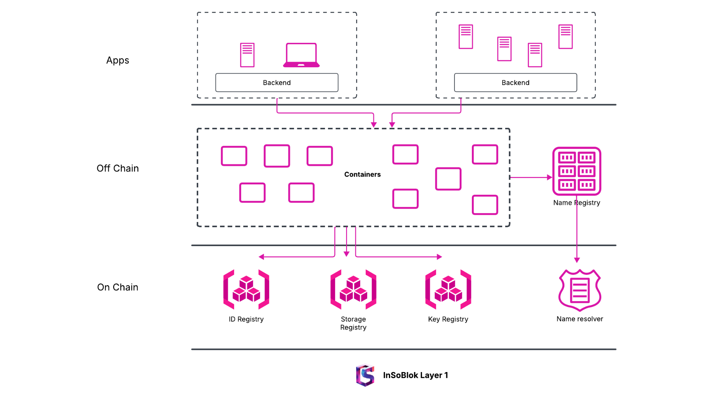

# Dynamic Sovereignity Architecture

InSoBlok Ecosytem has a hybrid architecture that stores identity onchain and data offchain.

<figure><figcaption></figcaption></figure>

## Onchain[​](https://docs.farcaster.xyz/learn/architecture/overview#onchain)

Insoblok onchain systems are implemented as contracts on OP Mainnet. Actions are performed onchain only when security and consistency are critical. Use of onchain actions is kept at a minimum to reduce costs and improve performance.

Only a handful of actions are performed onchain, including:

* Creating an account.
* Paying rent to store data.
* Adding account keys for connected apps.

## Offchain[​](https://docs.farcaster.xyz/learn/architecture/overview#offchain)

&#x20;InSoblok offchain system is a peer-to-peer network of servers called Containers which store user data. The majority of user actions are performed offchain. These include:

* Posting a new public message.
* Following another user.
* Reacting to a post.
* Updating your profile picture.

Actions are performed offchain when performance and cost are critical. Use of offchain actions is typically preferred when consistency isn't a strict requirement. Offchain systems achieve security by relying on signatures from onchain systems.

### Containers[​](https://docs.farcaster.xyz/learn/architecture/hubs#hubs)

&#x20;**Containers** are a distributed network of servers that store and validate InSoblok data.

A computer can run software to become an InSoblok Container. It will download onchain InSoBlok data from Layer 1 and offchain InSoBlok data from other Containers. Each container stores a copy of all InSoBlok data, which can be accessed over an API.

Container let you read and write data to InSoBlok, and anyone building an InSoBlok app will need to talk to one. Anyone can run a Container on their laptop or a cloud server.

### Design[​](https://docs.farcaster.xyz/learn/architecture/hubs#design)

&#x20;A Container starts by syncing data from Insoblok contracts on the Insoblok blockchain. It becomes aware of every user's account and their account keys.

The lifecycle of an Insoblok message looks like this:

1. Alice creates a new "Hello World!" message.
2. Alice (or her app) signs the message with an account key.
3. Alice (or her app) uploads the message to a Container.
4. The Container checks the message's validity.
5. The Container sends the message to peer Containers over gossip.

<figure><figcaption>
Container flow architecture
</figcaption></figure>

### Validation[​](https://docs.farcaster.xyz/learn/architecture/hubs#validation)

Alice's message is validated by checking that it has a valid signature from one of her account keys. The Container also ensures that the message obeys the requirements of the message type. For example, a public message or "cast" must be less than 320 bytes. Message type requirements are specified in detail in the protocol spec.

### Storage[​](https://docs.farcaster.xyz/learn/architecture/hubs#storage)

Alice's message is then checked for conflicts before being stored in the Container. Conflicts can occur for many reasons:

1. The Container already has a copy of the message.
2. The Container has a later message from Alice deleting this message.
3. Alice has only paid rent for 5000 casts, and this is her 5001st cast.

Conflicts are resolved deterministically and asynchronously using CRDTs (Conflict-free Replicated Data Types). For example, if Alice has no space to store messages, her oldest message will be removed.

### Replication[​](https://docs.farcaster.xyz/learn/architecture/hubs#replication)

&#x20;Containers sync using a two-phase process: gossip and diff sync. When a Container receives and stores a message, it immediately gossip it to its peers. Gossip is performed using libp2p's gossipsub protocol and is lossy. Containers then periodically select a random peer and perform a diff sync to find dropped messages. The diff sync process compares the merkle tries of message hashes to efficiently find dropped messages.

### Consistency[​](https://docs.farcaster.xyz/learn/architecture/hubs#consistency)

Containers are said to have strong eventual consistency. If a Container is disconnected, it can be written to it and will recover safely when it comes online. This is unlike blockchains where a node that is disconnected cannot confirm transactions. The downside is that messages may arrive out of order. For example, Bob's reply to Alice might appear before her "Hello World!" message.

### Peer Scoring[​](https://docs.farcaster.xyz/learn/architecture/hubs#peer-scoring)

Containers monitor peers and score their behavior. If a peer doesn't accept valid messages, falls behind, or chats too much, it may be ignored by its peers.

