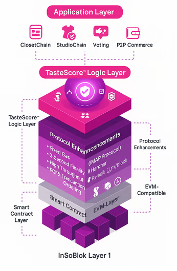

# Technical Innovations of Dynamic Sovereignty

*   **Zero-Knowledge Rollups (ZK-Rollups):** Implemented to enhance scalability while maintaining data privacy, allowing batch processing of transactions with cryptographic proofs of correctness.

<figure><figcaption></figcaption></figure>

* **Homomorphic Encryption:** Enables secure computations on encrypted data, ensuring privacy-preserving analytics without exposing sensitive user information.
* **Decentralized Key Management (DKM):** Utilizes threshold cryptography and distributed key generation (DKG) protocols to eliminate single points of failure in private key management.

<figure><figcaption></figcaption></figure>

* **Interoperable Governance Layer:** Facilitates cross-chain governance through standardized APIs and interoperability protocols like Polkadot’s Substrate and Cosmos IBC, enabling unified governance across multiple blockchain networks.

